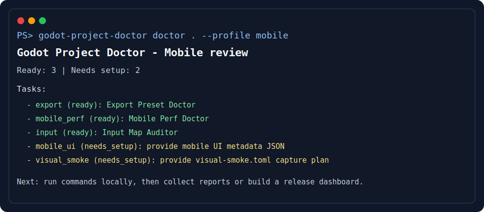

# Godot Production Toolkit

[](https://github.com/NonniGB/godot-production-toolkit/actions/workflows/ci.yml)
[](LICENSE)
[](#package-publication)

Godot CI and release evidence tools for maintainers.

Godot Production Toolkit helps maintainers review the evidence that usually sits
around a Godot release: export presets and generated builds, Android/mobile
readiness, localization and UI overflow risk, save migrations, runtime
telemetry, screenshots, scenario results, and release dashboards.

It is built as seventeen focused command-line tools, one umbrella CLI package, and two composite GitHub Actions. Each tool can run locally or in CI, with JSON/SARIF output for build scripts and Markdown/HTML reports for people.

**Quick start:** choose the workflow closest to the problem in front of you,
copy the command, and keep the report as a local or CI artifact. Install a
single PyPI package when you need one focused check, use the GitHub Action for
pull request reports, or install `godot-production-doctor` when you want the
`godot-production-doctor` umbrella command to run several tools together. The
historical `godot-project-doctor` command remains available for compatibility.


## Start Here

| Need | Start with | Useful output |
|---|---|---|
| Maintainer review page for PR or release evidence | [`godot-ci-doctor-action`](godot-ci-doctor-action/README.md), [`godot-release-dashboard-action`](godot-release-dashboard-action/README.md), [`godot-release-dashboard-kit`](godot-release-dashboard-kit/README.md) | JSON/Markdown/HTML reports plus a static dashboard artifact |
| Export and mobile release readiness | [`godot-export-preset-doctor`](godot-export-preset-doctor/README.md), [`godot-mobile-perf-doctor`](godot-mobile-perf-doctor/README.md), [`godot-mobile-ui-doctor`](godot-mobile-ui-doctor/README.md) | Export, renderer, texture, safe-area, and touch-readiness reports |
| Localization, screenshots, and runtime evidence | [`godot-localization-qa-guard`](godot-localization-qa-guard/README.md), [`godot-visual-smoke-test-kit`](godot-visual-smoke-test-kit/README.md), [`godot-runtime-telemetry-lab`](godot-runtime-telemetry-lab/README.md) | Localization reports, screenshot diffs, telemetry timelines, and dashboard cards |

Try the included fixture with one local command:

```powershell
godot-project-doctor run examples\release-readiness-demo\godot-project-doctor.toml --format markdown --output reports\release-readiness-summary.md
```

Add the main CI action to a Godot project:

```yaml
- uses: NonniGB/godot-production-toolkit/godot-ci-doctor-action@06d66f390a45743b4437d09bc63eb8778b52c0a4
  with:
    project: .
    checks: assets,export,input,localization,signals,mobile_perf
    tool-packages: godot-production-doctor godot-asset-pipeline-doctor godot-export-preset-doctor godot-input-map-auditor godot-localization-qa-guard godot-scene-signal-auditor godot-mobile-perf-doctor
    reports-dir: reports/godot-project-doctor
```

For a working public CI fixture, see the
[Godot Production Toolkit CI Demo](https://github.com/NonniGB/godot-production-toolkit-demo-ci).
For local walkthroughs, use the [Demo Paths](examples/demo-paths/README.md)
and [Sample Report Gallery](docs/assets/sample-reports/README.md).

## Workflow Lanes

| Lane | Use it for | Start here |
|---|---|---|
| Project and release evidence | First-pass audits, PR evidence, dashboard artifacts, and release checklist runs. | [`docs/workflows/README.md`](docs/workflows/README.md), [`godot-production-doctor`](godot-production-doctor/README.md), [`godot-ci-doctor-action`](godot-ci-doctor-action/README.md), [`godot-release-dashboard-action`](godot-release-dashboard-action/README.md) |
| Export and mobile readiness | Android, desktop, and web export settings; mobile renderer choices; texture and safe-area risks. | [`godot-export-preset-doctor`](godot-export-preset-doctor/README.md), [`godot-mobile-perf-doctor`](godot-mobile-perf-doctor/README.md), [`godot-mobile-ui-doctor`](godot-mobile-ui-doctor/README.md) |
| UI, input, localization, and visuals | Touch targets, input maps, translated text, screenshot plans, and visual diffs. | [`godot-input-map-auditor`](godot-input-map-auditor/README.md), [`godot-localization-qa-guard`](godot-localization-qa-guard/README.md), [`godot-visual-smoke-test-kit`](godot-visual-smoke-test-kit/README.md) |
| Runtime and scenario evidence | Scenario JSON/JUnit summaries, flakes, retries, telemetry budgets, and timeline reports. | [`godot-scenario-report-kit`](godot-scenario-report-kit/README.md), [`godot-runtime-telemetry-lab`](godot-runtime-telemetry-lab/README.md), [`godot-release-dashboard-kit`](godot-release-dashboard-kit/README.md) |
| Data, saves, packs, and content | Content references, save fixtures, migrations, pack manifests, DLC/mod load order, and policy checks. | [`godot-content-graph-doctor`](godot-content-graph-doctor/README.md), [`godot-save-schema-guard`](godot-save-schema-guard/README.md), [`godot-pack-mod-doctor`](godot-pack-mod-doctor/README.md) |
| Code and scene refactor review | GDScript dependency boundaries, scene contracts, signals, public API comments, and high-risk files. | [`godot-gdscript-architecture-guard`](godot-gdscript-architecture-guard/README.md), [`godot-scene-signal-auditor`](godot-scene-signal-auditor/README.md), [`gdscript-api-comment-coverage`](gdscript-api-comment-coverage/README.md) |

For a wider problem-to-tool map, see the [Tool Index](docs/TOOL_INDEX.md).
For practical search phrases such as "Godot export preset CI" or "Godot visual
regression testing", see the [Workflow Finder](docs/search-index.md).
For package-level install commands and search-friendly task names, see the
[Package Finder](docs/PACKAGE_FINDER.md).

## What This Is For

Use the toolkit when a maintainer needs repeatable evidence for practical Godot
release work:

- **Before an Android release:** verify export presets, icons, version fields, debug flags, mobile renderer settings, and texture size risks.
- **Before merging a UI/input change:** check that actions still cover keyboard, touch, mouse, and controller targets.
- **Before localizing a build:** catch missing translations, placeholder mismatches, unchanged strings, unused keys, and UI text that may overflow under stress translations.
- **Before changing save data:** generate baseline fixtures, validate saves against a schema, and document migration commands.
- **Before shipping visual changes:** compare screenshots against approved baselines.
- **Before reviewing a PR:** produce JSON, Markdown, HTML, and SARIF reports that make failures easier to reproduce.
- **Before signing off on a release branch:** collect export, mobile,
  localization, save, runtime, screenshot, and scenario evidence into one static
  dashboard.

In practice, that means checks for Godot Android exports, mobile UI safe areas,
touch targets, screenshot regressions, localization QA, asset imports, GDScript
architecture, and CI reports for Godot projects.

## Project Map

Start with these files when evaluating or extending the suite:

- `PROJECT_OVERVIEW.md`
- `docs/workflows/README.md`
- `docs/workflows/godot-starter-project-audit.md`
- `docs/TOOL_INDEX.md`
- `docs/PACKAGE_FINDER.md`
- `docs/USE_CASES.md`
- `docs/search-index.md`
- `docs/WORKS_WITH_YOUR_GODOT_WORKFLOW.md`
- `docs/diagrams/README.md`
- `docs/ROADMAP.md`
- `examples/demo-paths/README.md`
- `examples/release-readiness-demo/README.md`
- `docs/assets/sample-reports/README.md`
- `docs/PROJECT_HEALTH.md`
- `verify_tool_manifests.py`
- `verify_cli_smoke.py`

Discovery files for search tools, scripts, and compact project orientation:

- `docs/search-index.md`: practical problem phrases and workflow routing.
- `docs/PACKAGE_FINDER.md`: package names, install commands, and task phrases.
- `project-metadata.json`: structured project metadata.
- `*/tool-manifest.json`: per-tool command metadata.
- `llms.txt`: compact project summary for search tools and script readers.

## Install

Install the umbrella CLI and the tools you want to run from a checkout:

```powershell
python -m pip install -e .\godot-production-doctor
python -m pip install -e .\godot-asset-pipeline-doctor
python -m pip install -e .\godot-export-preset-doctor
python -m pip install -e .\godot-mobile-perf-doctor
```

The Python packages are also available from PyPI. Install the package that matches the check you need:

```powershell
python -m pip install gdscript-api-comment-coverage
python -m pip install godot-production-doctor
python -m pip install godot-asset-pipeline-doctor
python -m pip install godot-content-graph-doctor
python -m pip install godot-export-preset-doctor
python -m pip install godot-gdscript-architecture-guard
python -m pip install godot-input-map-auditor
python -m pip install godot-localization-qa-guard
python -m pip install godot-mobile-perf-doctor
python -m pip install godot-mobile-ui-doctor
python -m pip install godot-pack-mod-doctor
python -m pip install godot-release-dashboard-kit
python -m pip install godot-runtime-telemetry-lab
python -m pip install godot-save-schema-guard
python -m pip install godot-scenario-report-kit
python -m pip install godot-scene-signal-auditor
python -m pip install godot-visual-smoke-test-kit
python -m pip install pixel-space-asset-toolkit
```

Pick the package that matches the risk you are trying to reduce:

- `gdscript-api-comment-coverage`: before treating generated API docs or comment coverage as complete.
- `godot-export-preset-doctor`: before an Android, Windows, Linux, or web export job.
- `godot-asset-pipeline-doctor`: before merging new sprites, UI art, icons, or large textures.
- `godot-content-graph-doctor`: before merging data-driven items, recipes, quests, levels, or content packs.
- `godot-gdscript-architecture-guard`: before refactoring modules, autoloads, shared scripts, high fan-in/fan-out files, or stale resources.
- `godot-input-map-auditor`: before merging input, controller, or mobile-touch changes.
- `godot-localization-qa-guard`: before shipping translated builds or importing new localization files.
- `godot-mobile-perf-doctor`: before testing a Godot 4 project on Android hardware.
- `godot-mobile-ui-doctor`: before reviewing portrait/touch UI layout metadata.
- `godot-pack-mod-doctor`: before publishing pack, DLC, mod, or patch manifests.
- `godot-release-dashboard-kit`: when turning toolkit reports into one filterable static review page.
- `godot-runtime-telemetry-lab`: after scenario or soak runs produce frame/runtime samples, timelines, or budget checks.
- `godot-save-schema-guard`: before changing save data, generating save fixtures, or migration commands.
- `godot-scenario-report-kit`: after scenario, smoke, or regression runs produce JSON or JUnit XML evidence.
- `godot-scene-signal-auditor`: before refactoring scenes, signals, node groups, scene contracts, exported script properties, or autoload event wiring.
- `godot-visual-smoke-test-kit`: before approving UI, scene, or rendering changes with screenshot baselines.
- `pixel-space-asset-toolkit`: when generating deterministic pixel-art space assets or preview sheets.

Preview checks without writing files:

```powershell
godot-project-doctor run --project path\to\godot-project --checks assets,export,mobile_perf --dry-run --format json
```

Ask the umbrella CLI what it would run for a project:

```powershell
godot-project-doctor inspect path\to\godot-project
godot-project-doctor recommend path\to\godot-project
godot-project-doctor doctor path\to\godot-project --profile release
godot-project-doctor doctor path\to\godot-project --profile release --write-plan
godot-project-doctor doctor path\to\godot-project --profile mobile --format json
godot-project-doctor doctor path\to\godot-project --profile html5 --write-plan
godot-project-doctor doctor path\to\godot-project --profile runtime --write-plan
godot-project-doctor init path\to\godot-project --dry-run --include-workflow
```

`inspect` shows the project shape, sample files, detected addons/test
frameworks, and the checks the toolkit would start with. `recommend` turns that
scan into prioritized checks with setup notes and dry-run commands. `doctor`
groups tools into release profiles and focused Android, HTML5/Web, mobile UI,
localization, runtime, content pack, save migration, architecture, visual, and
QA checklists with expected inputs, output paths, commands, and an optional
Markdown setup plan.



Run checks, summarize the generated reports, and compare two runs:

```powershell
godot-project-doctor run --project path\to\godot-project --checks assets,export,mobile_perf --reports-dir reports\godot-project-doctor --format json --output reports\godot-project-doctor\summary.json
godot-project-doctor summarize reports\godot-project-doctor --format html --output reports\godot-project-doctor\summary.html
godot-project-doctor compare reports\baseline reports\current --format markdown --fail-on warning
godot-project-doctor collect --project path\to\godot-project --checks assets,export,mobile_perf --reports-dir reports\godot-project-doctor --evidence-dir reports\godot-project-doctor\evidence --skip-run
```

## Try The Included Demo

The repository includes a tiny synthetic Godot fixture with intentionally broken release settings:

```powershell
godot-project-doctor run examples\release-readiness-demo\godot-project-doctor.toml --format markdown --output docs\assets\sample-reports\release-readiness-summary.md
godot-project-doctor summarize docs\assets\sample-reports --format html --output docs\assets\sample-reports\release-readiness-summary.html
```


The demo shows how the toolkit reports incomplete Android export settings, risky pixel-art import settings, missing input-device coverage, and mobile performance warnings.

There is also a separate public CI fixture at
[NonniGB/godot-production-toolkit-demo-ci](https://github.com/NonniGB/godot-production-toolkit-demo-ci).
Its workflow runs `godot-ci-doctor-action`, builds a release dashboard, and
uploads both report artifacts from GitHub Actions.

## New Data And Runtime Tools

The newest packages cover content-heavy projects and runtime evidence:

```powershell
godot-content-graph godot-content-graph-doctor\examples\tiny-content-project --preset recipes --format markdown --fail-on none
godot-export-doctor matrix godot-export-preset-doctor\examples\bad-export-project --expected-platform Android --expected-platform Web --format html --output reports\export-matrix.html --fail-on none
godot-export-doctor leaks godot-export-preset-doctor\examples\bad-export-project --format html --output reports\export-leaks.html --fail-on none
godot-export-doctor diff godot-export-preset-doctor\examples\bad-export-project --baseline godot-export-preset-doctor\examples\bad-export-project --format markdown --fail-on none
godot-export-doctor inspect-folder build\android --hash-files --format json --output reports\exported-folder.json --fail-on none
godot-l10n-guard stress-pack godot-localization-qa-guard\examples\tiny-godot-project --translations godot-localization-qa-guard\examples\tiny-godot-project\translations --output-dir reports\localization-stress --format markdown --output reports\localization-stress.md
godot-l10n-guard capture-plan godot-localization-qa-guard\examples\tiny-godot-project --stress-pack reports\localization-stress\stress-pack-manifest.json --screen main_menu --screen settings --viewport portrait_phone --format markdown --output reports\localization-capture-plan.md
godot-mobile-ui-doctor layout-risk godot-mobile-ui-doctor\examples\tiny-mobile-ui-project\mobile-ui.json --stress-pack reports\localization-stress\stress-pack-manifest.json --format markdown --output reports\mobile-layout-risk.md
godot-mobile-ui-doctor layout-risk godot-mobile-ui-doctor\examples\tiny-mobile-ui-project\mobile-ui.json --stress-pack reports\localization-stress\stress-pack-manifest.json --format json --output reports\mobile-layout-risk.json
godot-mobile-ui-doctor overlays godot-mobile-ui-doctor\examples\tiny-mobile-ui-project\mobile-ui.json --layout-risk-report reports\mobile-layout-risk.json --output-dir reports\mobile-ui-overlays --fail-on none
godot-scenario-report summarize godot-scenario-report-kit\examples\tiny-scenario-runs\junit.xml --format markdown --output reports\scenario-junit-summary.md
godot-scenario-report manifest coverage godot-scenario-report-kit\examples\tiny-scenario-runs\scenario-manifest.json --results godot-scenario-report-kit\examples\tiny-scenario-runs\current --format html --output reports\scenario-coverage.html
godot-telemetry-lab timeline godot-runtime-telemetry-lab\examples\tiny-runtime-run --format json --output reports\runtime-timeline.json
godot-scenario-report bundle godot-scenario-report-kit\examples\tiny-scenario-runs\current --manifest godot-scenario-report-kit\examples\tiny-scenario-runs\scenario-manifest.json --telemetry reports\runtime-timeline.json --visual godot-scenario-report-kit\examples\tiny-scenario-runs\visual-smoke.json --evidence log=godot-scenario-report-kit\examples\tiny-scenario-runs\run.log --evidence junit=godot-scenario-report-kit\examples\tiny-scenario-runs\junit.xml --format json --output reports\scenario-bundle.json
godot-architecture-guard godot-gdscript-architecture-guard\examples\tiny-architecture-project --config architecture-guard.toml --format markdown --output reports\architecture.md --fail-on none
godot-mobile-ui-doctor matrix godot-mobile-ui-doctor\examples\tiny-mobile-ui-project\mobile-ui.json --format markdown
godot-mobile-ui-doctor overlays godot-mobile-ui-doctor\examples\tiny-mobile-ui-project\mobile-ui.json --output-dir reports\mobile-ui-overlays --fail-on none
godot-mobile-ui-doctor readiness godot-mobile-ui-doctor\examples\tiny-mobile-ui-project\mobile-ui.json --format markdown --fail-on none
godot-signal-audit godot-scene-signal-auditor\examples\tiny-godot-project --contract godot-scene-signal-auditor\examples\tiny-godot-project\scene-contract.json --baseline-contract godot-scene-signal-auditor\examples\tiny-godot-project\scene-contract.json --format json --fail-on none
godot-telemetry-lab adapt examples\godot-exporters\fixtures\runtime-telemetry.json --format json --output reports\runtime-normalized.json
godot-telemetry-lab budget init --profile android-high --output reports\runtime-budget.json
godot-telemetry-lab timeline godot-runtime-telemetry-lab\examples\tiny-runtime-run --budget-file reports\runtime-budget.json --format html --output reports\runtime-timeline.html
godot-pack-mod-doctor manifest from-folder addons\demo_pack --id demo_pack --version 1.0.0 --output pack-manifest.json
godot-pack-mod-doctor check pack-manifest.json --format markdown
godot-pack-mod-doctor diff baseline-pack.json current-pack.json --format markdown
godot-pack-mod-doctor load-order base-pack.json patch-pack.json optional-mod.json --format markdown
godot-pack-mod-doctor security pack-manifest.json --format markdown
godot-save-guard generate-fixture --schema godot-save-schema-guard\examples\schema\save.schema.json --fixture-output reports\generated-save.json --set 'player.id="pilot-1"' --format markdown --fail-on none
godot-save-guard migrate-chain saves\v1 --chain migrations.toml --output-dir reports\migrated-saves --schema schemas\save.schema.json --compare-original --format json --output reports\save-migration.json
godot-release-dashboard build godot-release-dashboard-kit\examples\tiny-release-evidence --previous-reports-dir godot-release-dashboard-kit\examples\tiny-release-evidence-previous --title "Godot Toolkit Release Evidence" --description "Synthetic release checks with scenario and runtime evidence" --output reports\dashboard.html
```

`scenario-bundle.json` files from `godot-scenario-report-kit` can live in the
same reports folder as other dashboard inputs, so scenario results, compact
telemetry summaries, logs, JUnit files, and screenshots are reviewed together.
Dashboard inputs can also provide `workflow` and `category` metadata so related
checks are grouped together in the static HTML report.
For release-history review, pass `--previous-reports-dir` to show added,
removed, and changed report cards with error and warning deltas.


## Workflows And Examples

- [Workflow guides](docs/workflows/) cover Android export CI, HTML5 export checks,
  runtime performance regression, mobile UI safe areas, visual regression,
  localization overflow, save migration, and mod/DLC validation.
- [Demo paths](examples/demo-paths/) group source inputs, commands, report
  snapshots, and screenshots for mobile release, content, and runtime review
  flows.
- [Public CI demo](https://github.com/NonniGB/godot-production-toolkit-demo-ci)
  is a separate tiny Godot project that runs the toolkit actions in GitHub
  Actions and uploads the dashboard artifact.
- [Godot exporter examples](examples/godot-exporters/) show small GDScript
  exporters for mobile UI metadata, scenario results, runtime telemetry, and
  pack manifests.
- [Search index](docs/search-index.md) maps practical problem phrases to the
  relevant workflow pages, packages, CI recipes, and sample reports.
- [Works with your Godot workflow](docs/WORKS_WITH_YOUR_GODOT_WORKFLOW.md)
  explains local CLI, GitHub Actions, artifact-only usage, and runtime impact.
- [Toolkit diagrams](docs/diagrams/) show how reports, release evidence, and
  mobile-readiness checks fit together.
- [GitHub Action READMEs](godot-ci-doctor-action/README.md) and
  [`godot-release-dashboard-action`](godot-release-dashboard-action/README.md)
  provide workflow snippets to adapt inside a Godot project.
- [Sample report gallery](docs/assets/sample-reports/README.md) links to generated sample reports,
  screenshots, fixtures, and the commands used to recreate them.
- [Report schemas](docs/report-schemas/) document stable top-level JSON report
  fields for scripts and CI consumers.
- [Roadmap](docs/ROADMAP.md) groups future work by user-facing Godot workflow.

## Package Boundaries

The root README stays workflow-first. Use these docs when you need a precise
package choice:

- [Workflow guides](docs/workflows/README.md): release and review tasks with
  the inputs and artifacts to keep.
- [Tool Index](docs/TOOL_INDEX.md): problem-to-command map for every package.
- [Package Finder](docs/PACKAGE_FINDER.md): PyPI install commands, profile
  package sets, and first-run command examples.
- [Search index](docs/search-index.md): practical phrases that route to the
  right workflow page, package, CI recipe, or sample report.

The rough split is:

| Lane | Packages |
|---|---|
| Project and release evidence | `godot-production-doctor`, `godot-ci-doctor-action`, `godot-release-dashboard-action`, `godot-release-dashboard-kit` |
| Export and mobile readiness | `godot-export-preset-doctor`, `godot-mobile-perf-doctor`, `godot-mobile-ui-doctor`, `godot-asset-pipeline-doctor` |
| UI, input, localization, and visuals | `godot-input-map-auditor`, `godot-localization-qa-guard`, `godot-visual-smoke-test-kit`, `pixel-space-asset-toolkit` |
| Runtime and scenario evidence | `godot-scenario-report-kit`, `godot-runtime-telemetry-lab` |
| Data, saves, packs, and content | `godot-content-graph-doctor`, `godot-save-schema-guard`, `godot-pack-mod-doctor` |
| Code and scene refactor review | `godot-gdscript-architecture-guard`, `godot-scene-signal-auditor`, `gdscript-api-comment-coverage` |

## GitHub Action

Add the suite to a Godot project with one workflow step:

```yaml
- uses: NonniGB/godot-production-toolkit/godot-ci-doctor-action@06d66f390a45743b4437d09bc63eb8778b52c0a4
  with:
    project: .
    checks: assets,export,input,localization,signals,mobile_perf
    fail-on: error
    tool-packages: godot-production-doctor godot-asset-pipeline-doctor godot-export-preset-doctor godot-input-map-auditor godot-localization-qa-guard godot-scene-signal-auditor godot-mobile-perf-doctor
    reports-dir: reports/godot-project-doctor
```

Upload `reports/godot-project-doctor` as a workflow artifact to keep JSON, Markdown, and HTML reports with each run.

Build a dashboard artifact from reports produced by earlier jobs:

```yaml
- uses: NonniGB/godot-production-toolkit/godot-release-dashboard-action@06d66f390a45743b4437d09bc63eb8778b52c0a4
  with:
    reports-dir: reports/release-evidence
    dashboard-dir: reports/release-dashboard
    dashboard-title: Godot Release Evidence
```

## Validation

Run from the repository root:

```powershell
python verify_tool_manifests.py
python verify_release_alignment.py
python verify_cli_smoke.py
python project_health_snapshot.py
python -m unittest discover -s tests -v
```

Run each package suite from that package directory:

```powershell
python -m unittest discover -s tests -v
```

## Repository Layout

Every standalone tool has the same basic shape so it is easy to browse, test, and package:

- `README.md`
- `LICENSE`
- `CHANGELOG.md`
- `CONTRIBUTING.md`
- `SECURITY.md`
- `tool-manifest.json`
- `docs/AUTOMATION.md`
- `examples/`
- `tests/`
- `pyproject.toml`

The root folder adds CI metadata, issue templates, a PR template, project metadata, and release guidance.

## Project Maintenance

These root-level files explain how the project is maintained and how contributors can report issues:

- `LICENSE`
- `CONTRIBUTING.md`
- `SECURITY.md`
- `SUPPORT.md`
- `CODE_OF_CONDUCT.md`
- `CHANGELOG.md`
- `.github/CODEOWNERS`
- `.github/dependabot.yml`

## Install Packages

The repo keeps the tools together. The installable umbrella package is `godot-production-doctor`; it provides the `godot-project-doctor` command used in the examples below.

| Package | Current Version |
|---|---:|
| [`gdscript-api-comment-coverage`](https://pypi.org/project/gdscript-api-comment-coverage/) | `0.1.3` |
| [`godot-asset-pipeline-doctor`](https://pypi.org/project/godot-asset-pipeline-doctor/) | `0.1.10` |
| [`godot-content-graph-doctor`](https://pypi.org/project/godot-content-graph-doctor/) | `0.1.4` |
| [`godot-export-preset-doctor`](https://pypi.org/project/godot-export-preset-doctor/) | `0.1.13` |
| [`godot-gdscript-architecture-guard`](https://pypi.org/project/godot-gdscript-architecture-guard/) | `0.1.6` |
| [`godot-input-map-auditor`](https://pypi.org/project/godot-input-map-auditor/) | `0.1.3` |
| [`godot-localization-qa-guard`](https://pypi.org/project/godot-localization-qa-guard/) | `0.1.5` |
| [`godot-mobile-perf-doctor`](https://pypi.org/project/godot-mobile-perf-doctor/) | `0.1.8` |
| [`godot-mobile-ui-doctor`](https://pypi.org/project/godot-mobile-ui-doctor/) | `0.1.15` |
| [`godot-pack-mod-doctor`](https://pypi.org/project/godot-pack-mod-doctor/) | `0.1.6` |
| [`godot-production-doctor`](https://pypi.org/project/godot-production-doctor/) | `0.2.4` |
| [`godot-release-dashboard-kit`](https://pypi.org/project/godot-release-dashboard-kit/) | `0.1.16` |
| [`godot-runtime-telemetry-lab`](https://pypi.org/project/godot-runtime-telemetry-lab/) | `0.1.7` |
| [`godot-save-schema-guard`](https://pypi.org/project/godot-save-schema-guard/) | `0.1.8` |
| [`godot-scenario-report-kit`](https://pypi.org/project/godot-scenario-report-kit/) | `0.1.11` |
| [`godot-scene-signal-auditor`](https://pypi.org/project/godot-scene-signal-auditor/) | `0.1.5` |
| [`godot-visual-smoke-test-kit`](https://pypi.org/project/godot-visual-smoke-test-kit/) | `0.1.3` |
| [`pixel-space-asset-toolkit`](https://pypi.org/project/pixel-space-asset-toolkit/) | `0.1.4` |
