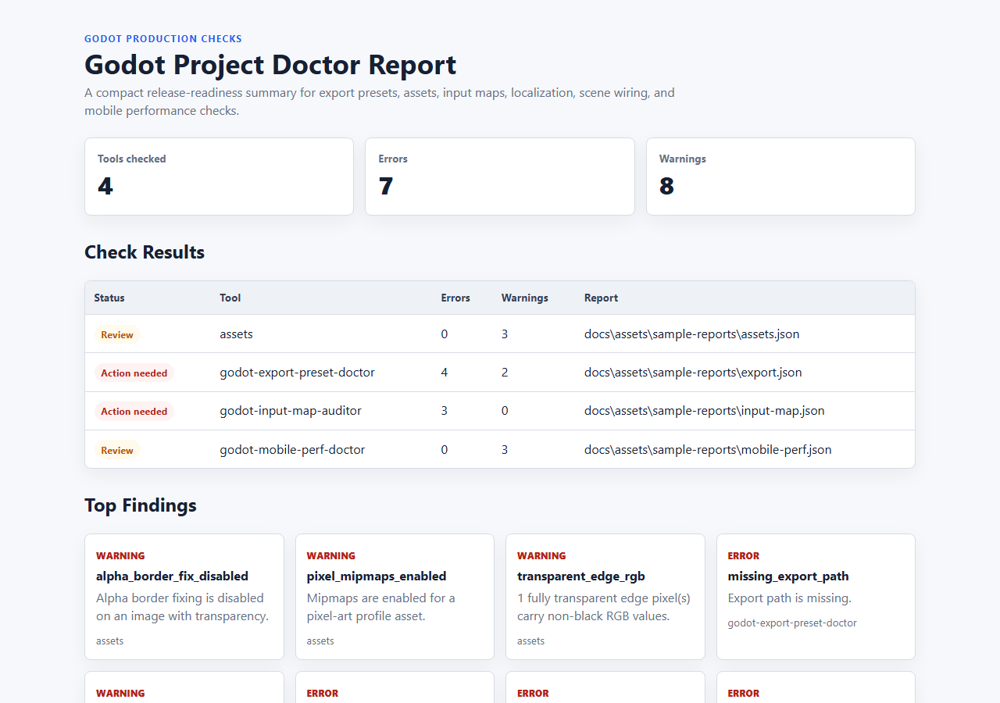
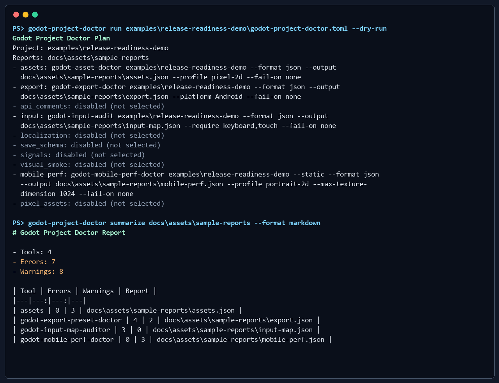
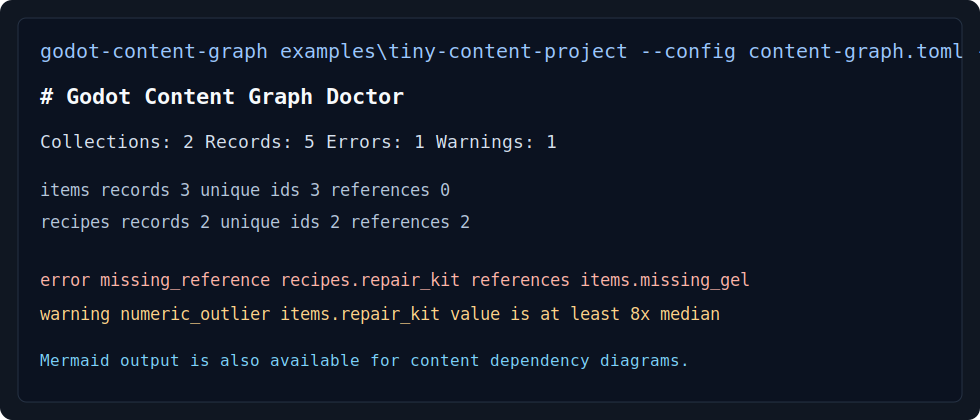
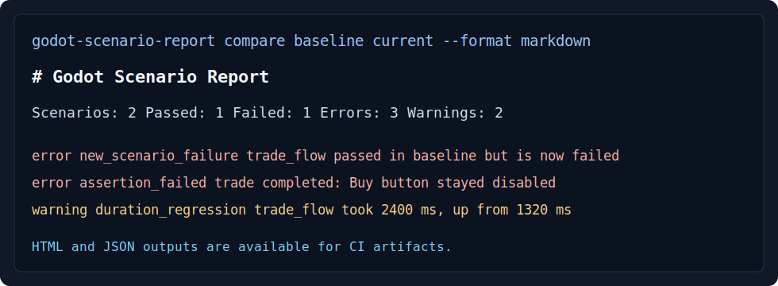
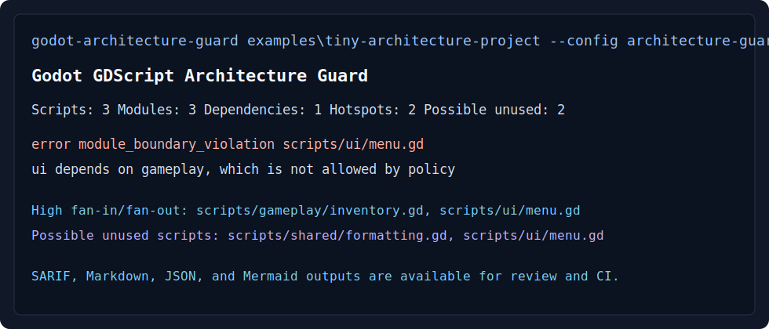
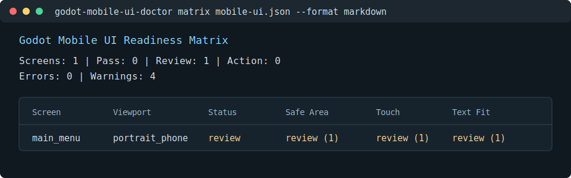
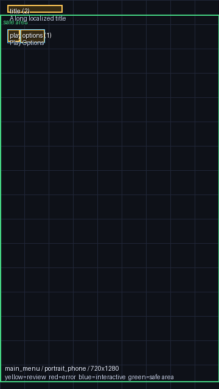

# Godot Production Toolkit

[](https://github.com/NonniGB/godot-production-toolkit/actions/workflows/ci.yml)
[](LICENSE)
[](#package-publication)

CI-friendly production diagnostics for Godot 4 projects.

Godot Production Toolkit helps solo developers and small teams catch release risks before they become late-stage debugging work: export preset mistakes, texture/import problems, mobile performance hazards, input coverage gaps, localization defects, save compatibility drift, scene signal issues, and visual regressions.

It is built as fourteen standalone command-line tools, one umbrella CLI, and one GitHub Action. Each tool can run locally or in CI, with JSON/SARIF output for build scripts and Markdown/HTML reports for people.

**Fastest path:** install one of the PyPI packages below if you need a single check today, or use the GitHub Action if you want release-readiness reports on every pull request. Use the source checkout when you want the umbrella `godot-project-doctor` command to run several tools together.



## What This Is For

Use the toolkit when you want repeatable checks around practical Godot release work:

- **Before an Android release:** verify export presets, icons, version fields, debug flags, mobile renderer settings, and texture size risks.
- **Before merging a UI/input change:** check that actions still cover keyboard, touch, mouse, and controller targets.
- **Before localizing a build:** catch missing translations, placeholder mismatches, unchanged strings, and unused keys.
- **Before changing save data:** validate save fixtures against a schema and document migration commands.
- **Before shipping visual changes:** compare screenshots against approved baselines.
- **Before reviewing a PR:** produce JSON, Markdown, HTML, and SARIF reports that make failures easier to reproduce.

In practice, that means checks for Godot Android exports, mobile UI safe areas,
touch targets, screenshot regressions, localization QA, asset imports, GDScript
architecture, and CI reports for Godot projects.

## Project Map

Start with these files when evaluating or extending the suite:

- `PROJECT_OVERVIEW.md`
- `docs/TOOL_INDEX.md`
- `docs/USE_CASES.md`
- `llms.txt`
- `examples/release-readiness-demo/README.md`
- `docs/PROJECT_HEALTH.md`
- `verify_tool_manifests.py`

## Quick Start

Install the umbrella CLI and the tools you want to run from a checkout:

```powershell
python -m pip install -e .\godot-project-doctor
python -m pip install -e .\godot-asset-pipeline-doctor
python -m pip install -e .\godot-export-preset-doctor
python -m pip install -e .\godot-mobile-perf-doctor
```

The standalone tools are also available from PyPI. Install the package that matches the check you need:

```powershell
python -m pip install gdscript-api-comment-coverage
python -m pip install godot-asset-pipeline-doctor
python -m pip install godot-content-graph-doctor
python -m pip install godot-export-preset-doctor
python -m pip install godot-gdscript-architecture-guard
python -m pip install godot-input-map-auditor
python -m pip install godot-localization-qa-guard
python -m pip install godot-mobile-perf-doctor
python -m pip install godot-mobile-ui-doctor
python -m pip install godot-save-schema-guard
python -m pip install godot-scenario-report-kit
python -m pip install godot-scene-signal-auditor
python -m pip install godot-visual-smoke-test-kit
python -m pip install pixel-space-asset-toolkit
```

Pick the package that matches the risk you are trying to reduce:

- `gdscript-api-comment-coverage`: before treating generated API docs or comment coverage as complete.
- `godot-export-preset-doctor`: before an Android, Windows, Linux, or web export job.
- `godot-asset-pipeline-doctor`: before merging new sprites, UI art, icons, or large textures.
- `godot-content-graph-doctor`: before merging data-driven items, recipes, quests, levels, or content packs.
- `godot-gdscript-architecture-guard`: before refactoring modules, autoloads, or shared GDScript code.
- `godot-input-map-auditor`: before merging input, controller, or mobile-touch changes.
- `godot-localization-qa-guard`: before shipping translated builds or importing new localization files.
- `godot-mobile-perf-doctor`: before testing a Godot 4 project on Android hardware.
- `godot-mobile-ui-doctor`: before reviewing portrait/touch UI layout metadata.
- `godot-save-schema-guard`: before changing save data, save fixtures, or migration commands.
- `godot-scenario-report-kit`: after scenario, smoke, or regression runs produce JSON evidence.
- `godot-scene-signal-auditor`: before refactoring scenes, signals, or autoload event wiring.
- `godot-visual-smoke-test-kit`: before approving UI, scene, or rendering changes with screenshot baselines.
- `pixel-space-asset-toolkit`: when generating deterministic pixel-art space assets or preview sheets.

Preview checks without writing files:

```powershell
godot-project-doctor run --project path\to\godot-project --checks assets,export,mobile_perf --dry-run --format json
```

Ask the umbrella CLI what it would run for a project:

```powershell
godot-project-doctor inspect path\to\godot-project
godot-project-doctor recommend path\to\godot-project
godot-project-doctor init path\to\godot-project --dry-run --include-workflow
```

`inspect` shows the project shape, sample files, detected addons/test
frameworks, and the checks the toolkit would start with. `recommend` turns that
scan into prioritized checks with setup notes and dry-run commands.

Run checks, summarize the generated reports, and compare two runs:

```powershell
godot-project-doctor run --project path\to\godot-project --checks assets,export,mobile_perf --reports-dir reports\godot-project-doctor --format json --output reports\godot-project-doctor\summary.json
godot-project-doctor summarize reports\godot-project-doctor --format html --output reports\godot-project-doctor\summary.html
godot-project-doctor compare reports\baseline reports\current --format markdown --fail-on warning
godot-project-doctor collect --project path\to\godot-project --checks assets,export,mobile_perf --reports-dir reports\godot-project-doctor --evidence-dir reports\godot-project-doctor\evidence --skip-run
```

## Try The Included Demo

The repository includes a tiny synthetic Godot fixture with intentionally broken release settings:

```powershell
godot-project-doctor run examples\release-readiness-demo\godot-project-doctor.toml --format markdown --output docs\assets\sample-reports\release-readiness-summary.md
godot-project-doctor summarize docs\assets\sample-reports --format html --output docs\assets\sample-reports\release-readiness-summary.html
```



The demo shows how the toolkit reports incomplete Android export settings, risky pixel-art import settings, missing input-device coverage, and mobile performance warnings.

## New Data And Runtime Tools

The newest packages cover content-heavy projects and runtime evidence:

```powershell
godot-content-graph godot-content-graph-doctor\examples\tiny-content-project --preset recipes --format markdown --fail-on none
godot-scenario-report compare godot-scenario-report-kit\examples\tiny-scenario-runs\baseline godot-scenario-report-kit\examples\tiny-scenario-runs\current --format markdown
godot-architecture-guard godot-gdscript-architecture-guard\examples\tiny-architecture-project --config architecture-guard.toml --format markdown
godot-mobile-ui-doctor matrix godot-mobile-ui-doctor\examples\tiny-mobile-ui-project\mobile-ui.json --format markdown
godot-mobile-ui-doctor overlays godot-mobile-ui-doctor\examples\tiny-mobile-ui-project\mobile-ui.json --output-dir reports\mobile-ui-overlays --fail-on none
godot-mobile-ui-doctor readiness godot-mobile-ui-doctor\examples\tiny-mobile-ui-project\mobile-ui.json --format markdown --fail-on none
```







A separate public demo repository shows the GitHub Action in a clean fixture project:

- [godot-production-toolkit-demo](https://github.com/NonniGB/godot-production-toolkit-demo)

## Tool Set

| Tool | Purpose | Script/CI Outputs |
|---|---|---|
| `godot-project-doctor` | Umbrella CLI for planning, running, summarizing, and comparing the suite. | JSON, Markdown, HTML |
| `godot-ci-doctor-action` | GitHub composite action wrapper. | JSON, Markdown, HTML artifacts |
| `godot-asset-pipeline-doctor` | PNG/audio and `.import` checks for pixel art, mobile memory, and package-size risks. | JSON, SARIF |
| `godot-content-graph-doctor` | Data-driven content id, reference, and numeric outlier checks. | JSON, Markdown, Mermaid |
| `godot-export-preset-doctor` | Release-readiness checks for `export_presets.cfg`. | JSON, SARIF |
| `gdscript-api-comment-coverage` | Public GDScript API docs and comment coverage gate. | JSON, Markdown |
| `godot-gdscript-architecture-guard` | GDScript module boundaries, autoload access, and dependency policy checks. | JSON, SARIF, Markdown, Mermaid |
| `godot-input-map-auditor` | Input device coverage and duplicate binding checks. | JSON, SARIF, Markdown |
| `godot-localization-qa-guard` | CSV/PO localization QA and translation-key usage scan. | JSON, SARIF, Markdown |
| `godot-save-schema-guard` | Save fixture schema validation and migration command checks. | JSON, Markdown |
| `godot-scenario-report-kit` | Scenario run evidence summary and baseline comparison. | JSON, Markdown, HTML |
| `godot-scene-signal-auditor` | Scene signal connection and autoload coupling analysis. | JSON, Mermaid |
| `godot-visual-smoke-test-kit` | Screenshot diffing, approval, and Godot capture command planning. | JSON, PNG diffs |
| `godot-mobile-perf-doctor` | Static mobile performance diagnostics. | JSON, SARIF, Markdown |
| `godot-mobile-ui-doctor` | Mobile UI safe-area, touch-target, spacing, text-overflow, overlay previews, and combined mobile readiness reports. | JSON, Markdown, PNG, text |
| `pixel-space-asset-toolkit` | Deterministic pixel sci-fi asset utilities, galleries, and PNG image/directory diff checks. | JSON, PNG, HTML |

## Choose By Problem

| Problem | Start With |
|---|---|
| Android export is fragile or hard to review | `godot-export-preset-doctor`, `godot-mobile-perf-doctor` |
| Imported art looks wrong, uses too much memory, or has bad sprite anchors | `godot-asset-pipeline-doctor` |
| Input works on desktop but not touch/gamepad | `godot-input-map-auditor` |
| Portrait UI needs touch and safe-area review | `godot-mobile-ui-doctor`, `godot-visual-smoke-test-kit` |
| Data files reference missing items, recipes, quests, or levels | `godot-content-graph-doctor` |
| Runtime scenario runs need reviewable evidence | `godot-scenario-report-kit` |
| GDScript modules or autoloads are becoming tangled | `godot-gdscript-architecture-guard` |
| Translation imports keep breaking placeholders or keys | `godot-localization-qa-guard` |
| Save data changes need fixture coverage | `godot-save-schema-guard` |
| Scene refactors break signal wiring | `godot-scene-signal-auditor` |
| UI or rendering changes need screenshot evidence | `godot-visual-smoke-test-kit` |

For a more complete problem-to-tool map with commands and package names, see
[`docs/TOOL_INDEX.md`](docs/TOOL_INDEX.md).

## GitHub Action

Add the suite to a Godot project with one workflow step:

```yaml
- uses: NonniGB/godot-production-toolkit/godot-ci-doctor-action@v0.1.2
  with:
    project: .
    checks: assets,export,input,localization,signals,mobile_perf
    fail-on: error
    reports-dir: reports/godot-project-doctor
```

Upload `reports/godot-project-doctor` as a workflow artifact to keep JSON, Markdown, and HTML reports with each run.

## Validation

Run from the repository root:

```powershell
python verify_tool_manifests.py
python verify_release_alignment.py
python project_health_snapshot.py
python -m unittest discover -s tests -v
```

Run each package suite from that package directory:

```powershell
python -m unittest discover -s tests -v
```

## What's Included

Every standalone tool has the same basic shape so it is easy to browse, test, and package:

- `README.md`
- `LICENSE`
- `CHANGELOG.md`
- `CONTRIBUTING.md`
- `SECURITY.md`
- `tool-manifest.json`
- `docs/AUTOMATION.md`
- `examples/`
- `tests/`
- `pyproject.toml`

The root folder adds CI metadata, issue templates, a PR template, project metadata, and release guidance.

## Maintainer Notes

These root-level files explain how the project is maintained and how contributors can report issues:

- `LICENSE`
- `CONTRIBUTING.md`
- `SECURITY.md`
- `SUPPORT.md`
- `CODE_OF_CONDUCT.md`
- `CHANGELOG.md`
- `.github/CODEOWNERS`
- `.github/dependabot.yml`

## Install Packages

The repo keeps the tools together. Most standalone CLIs can also be installed from PyPI, while `godot-project-doctor` is available from a source checkout.

| Package | Current Version |
|---|---:|
| [`gdscript-api-comment-coverage`](https://pypi.org/project/gdscript-api-comment-coverage/) | `0.1.3` |
| [`godot-asset-pipeline-doctor`](https://pypi.org/project/godot-asset-pipeline-doctor/) | `0.1.9` |
| [`godot-content-graph-doctor`](https://pypi.org/project/godot-content-graph-doctor/) | `0.1.3` |
| [`godot-export-preset-doctor`](https://pypi.org/project/godot-export-preset-doctor/) | `0.1.6` |
| [`godot-gdscript-architecture-guard`](https://pypi.org/project/godot-gdscript-architecture-guard/) | `0.1.1` |
| [`godot-input-map-auditor`](https://pypi.org/project/godot-input-map-auditor/) | `0.1.3` |
| [`godot-localization-qa-guard`](https://pypi.org/project/godot-localization-qa-guard/) | `0.1.3` |
| [`godot-mobile-perf-doctor`](https://pypi.org/project/godot-mobile-perf-doctor/) | `0.1.6` |
| [`godot-mobile-ui-doctor`](https://pypi.org/project/godot-mobile-ui-doctor/) | `0.1.7` |
| [`godot-save-schema-guard`](https://pypi.org/project/godot-save-schema-guard/) | `0.1.2` |
| [`godot-scenario-report-kit`](https://pypi.org/project/godot-scenario-report-kit/) | `0.1.0` |
| [`godot-scene-signal-auditor`](https://pypi.org/project/godot-scene-signal-auditor/) | `0.1.2` |
| [`godot-visual-smoke-test-kit`](https://pypi.org/project/godot-visual-smoke-test-kit/) | `0.1.2` |
| [`pixel-space-asset-toolkit`](https://pypi.org/project/pixel-space-asset-toolkit/) | `0.1.4` |
