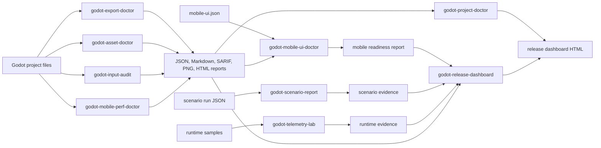
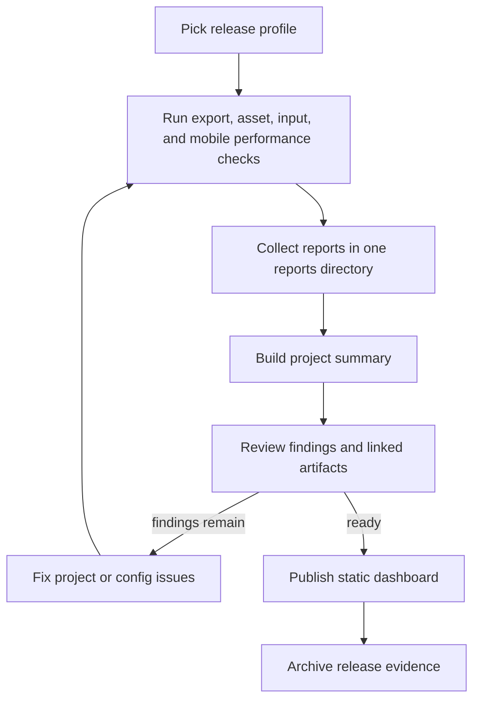
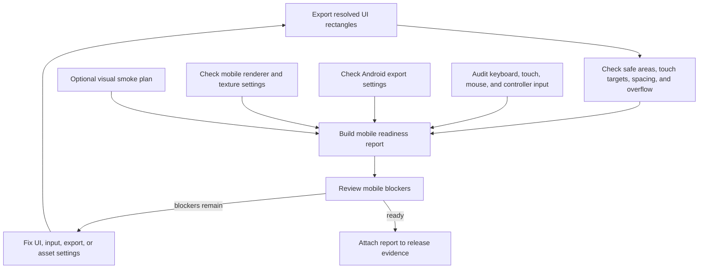

# Toolkit Diagrams

These GitHub-renderable Mermaid diagrams show how the Godot Production Toolkit
pieces fit together. For command details, start with the
[Tool Index](../TOOL_INDEX.md), [Use Cases](../USE_CASES.md),
[workflow guides](../workflows/), and [report gallery](../report-gallery/).

## Tool Output Flow

See the [Tool Index](../TOOL_INDEX.md) for package names and output formats.

## Release Evidence Workflow

Useful references:
[CI release checklist](../workflows/godot-ci-release-checklist.md),
[Android export CI](../workflows/godot-android-export-ci.md), and
[release dashboard samples](../report-gallery/).

## Mobile Readiness Workflow

Useful references:
[mobile UI safe-area testing](../workflows/godot-mobile-ui-safe-area-testing.md),
[localization overflow testing](../workflows/godot-localization-overflow-testing.md),
and [Mobile UI Readiness](../USE_CASES.md#mobile-ui-readiness).
