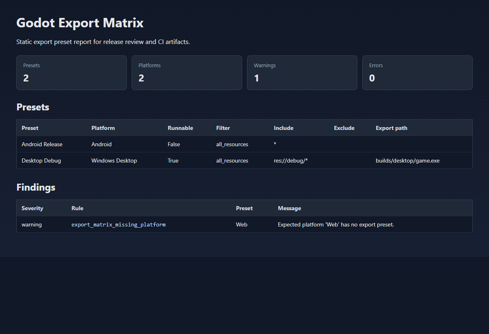
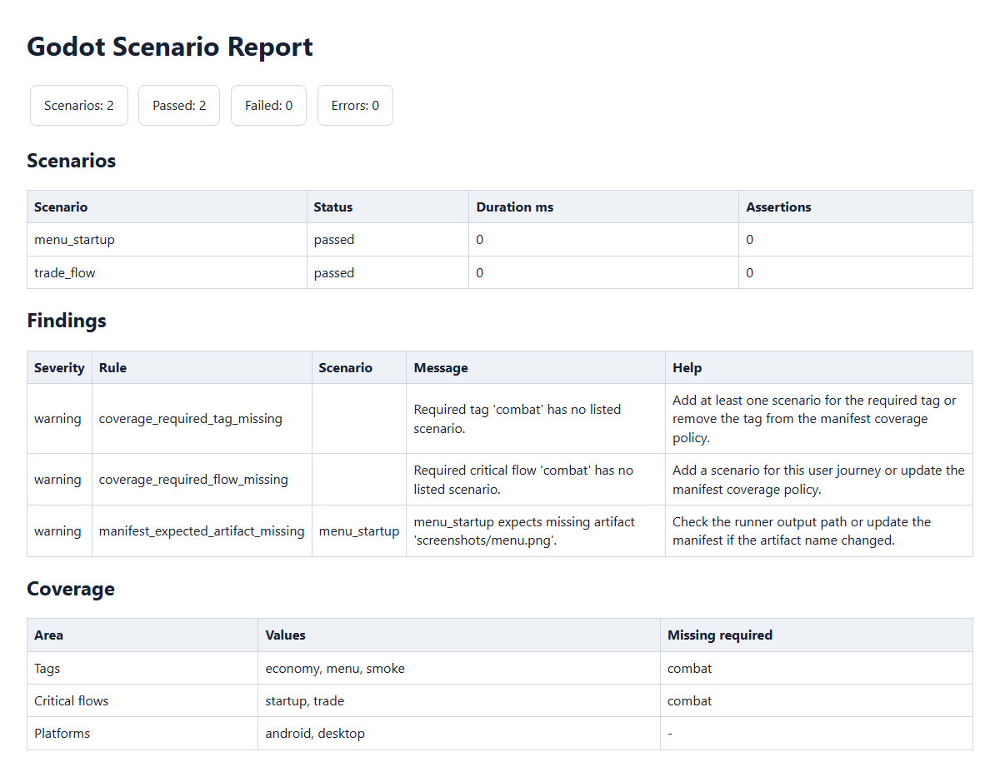
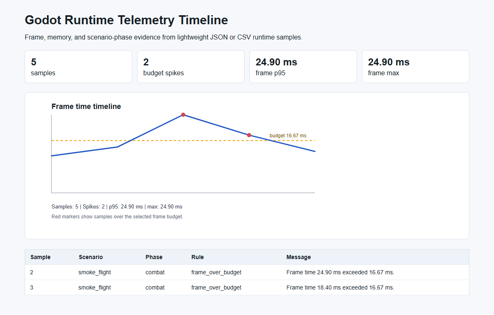
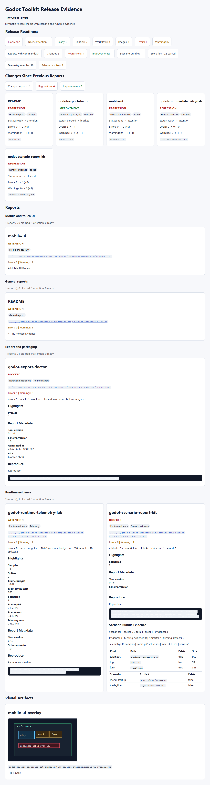

# Public Report Gallery

This gallery collects the small, public sample reports and screenshots already
checked into this repository. The fixtures are intentionally tiny and synthetic:
they are useful for docs, visual review, and CLI smoke examples, not for adoption
claims or benchmark comparisons.

## Start Here

| Sample | Report | Screenshot | Minimal fixture | Regenerate from the repo root |
|---|---|---|---|---|
| Release readiness summary | [Markdown](../assets/sample-reports/release-readiness-summary.md), [HTML](../assets/sample-reports/release-readiness-summary.html), [terminal transcript](../assets/sample-reports/terminal-demo.txt) | [HTML report PNG](../assets/screenshots/project-doctor-html-report.png), [terminal PNG](../assets/screenshots/project-doctor-terminal.png) | [release-readiness-demo](../../examples/release-readiness-demo/README.md) | `godot-project-doctor run examples\release-readiness-demo\godot-project-doctor.toml --format markdown --output docs\assets\sample-reports\release-readiness-summary.md` then `godot-project-doctor summarize docs\assets\sample-reports --format html --output docs\assets\sample-reports\release-readiness-summary.html` |
| Starter project audit | [Markdown](../assets/sample-reports/starter-project-audit.md) | [HTML report PNG](../assets/screenshots/project-doctor-html-report.png) | [release-readiness-demo](../../examples/release-readiness-demo/README.md) | `godot-project-doctor run examples\release-readiness-demo\godot-project-doctor.toml --format markdown --output docs\assets\sample-reports\release-readiness-summary.md` |
| Export preset matrix | [Markdown](../assets/sample-reports/export-matrix.md), [HTML](../assets/sample-reports/export-matrix.html), [leak HTML](../assets/sample-reports/export-leaks.html) | [matrix PNG](../assets/screenshots/export-matrix.png) | [bad-export-project](../../godot-export-preset-doctor/examples/bad-export-project/export_presets.cfg) | `godot-export-doctor matrix godot-export-preset-doctor\examples\bad-export-project --expected-platform Android --expected-platform Web --format html --output docs\assets\sample-reports\export-matrix.html --fail-on none` |
| Project doctor dry run | [dry-run plan](../assets/sample-reports/dry-run-plan.txt) | [profile checklist SVG](../assets/screenshots/project-doctor-profile.svg) | [release-readiness-demo](../../examples/release-readiness-demo/README.md) | `godot-project-doctor run examples\release-readiness-demo\godot-project-doctor.toml --dry-run` |
| Content graph | [Markdown](../assets/sample-reports/content-graph-summary.md) | [terminal SVG](../assets/screenshots/content-graph-terminal.svg) | [tiny-content-project](../../godot-content-graph-doctor/examples/tiny-content-project/README.md) | `godot-content-graph godot-content-graph-doctor\examples\tiny-content-project --preset recipes --format markdown --output docs\assets\sample-reports\content-graph-summary.md --fail-on none` |
| Scenario comparison | [Markdown](../assets/sample-reports/scenario-compare.md) | [terminal SVG](../assets/screenshots/scenario-report-terminal.svg) | [tiny-scenario-runs](../../godot-scenario-report-kit/examples/tiny-scenario-runs/README.md) | `godot-scenario-report compare godot-scenario-report-kit\examples\tiny-scenario-runs\baseline godot-scenario-report-kit\examples\tiny-scenario-runs\current --format markdown --output docs\assets\sample-reports\scenario-compare.md` |
| Scenario JUnit XML summary | [Markdown](../assets/sample-reports/scenario-junit-summary.md) | n/a | [tiny-scenario-runs](../../godot-scenario-report-kit/examples/tiny-scenario-runs/README.md) | `godot-scenario-report summarize godot-scenario-report-kit\examples\tiny-scenario-runs\junit.xml --format markdown --output docs\assets\sample-reports\scenario-junit-summary.md` |
| Scenario manifest coverage | [HTML](../assets/sample-reports/scenario-coverage.html), [flake Markdown](../assets/sample-reports/scenario-flakes.md) | [coverage PNG](../assets/screenshots/scenario-coverage.png) | [tiny-scenario-runs](../../godot-scenario-report-kit/examples/tiny-scenario-runs/README.md) | `godot-scenario-report manifest coverage godot-scenario-report-kit\examples\tiny-scenario-runs\scenario-manifest.json --results godot-scenario-report-kit\examples\tiny-scenario-runs\current --format html --output docs\assets\sample-reports\scenario-coverage.html` and `godot-scenario-report flake compare godot-scenario-report-kit\examples\tiny-scenario-runs\baseline godot-scenario-report-kit\examples\tiny-scenario-runs\current godot-scenario-report-kit\examples\tiny-scenario-runs\repeat-run godot-scenario-report-kit\examples\tiny-scenario-runs\retry-run --format markdown --output docs\assets\sample-reports\scenario-flakes.md --fail-on none` |
| Architecture guard | [Markdown](../assets/sample-reports/architecture-guard.md) | [terminal SVG](../assets/screenshots/architecture-guard-terminal.svg) | [tiny-architecture-project](../../godot-gdscript-architecture-guard/examples/tiny-architecture-project/README.md) | `godot-architecture-guard godot-gdscript-architecture-guard\examples\tiny-architecture-project --config architecture-guard.toml --format markdown --output docs\assets\sample-reports\architecture-guard.md --fail-on none` |
| Mobile UI checks | [layout report](../assets/sample-reports/mobile-ui.md), [readiness matrix](../assets/sample-reports/mobile-ui-matrix.md), [localization layout risk](../assets/sample-reports/mobile-ui-layout-risk.md), [layout-risk JSON](../assets/sample-reports/mobile-ui-layout-risk.json), [localization capture plan](../assets/sample-reports/localization-capture-plan.md) | [terminal SVG](../assets/screenshots/mobile-ui-terminal.svg), [matrix SVG](../assets/screenshots/mobile-ui-matrix.svg), [overlay PNG](../../godot-mobile-ui-doctor/docs/images/mobile-ui-overlays/main_menu__portrait_phone.png) | [tiny-mobile-ui-project](../../godot-mobile-ui-doctor/examples/tiny-mobile-ui-project) | `godot-mobile-ui-doctor godot-mobile-ui-doctor\examples\tiny-mobile-ui-project\mobile-ui.json --format markdown --output docs\assets\sample-reports\mobile-ui.md --fail-on none` and `godot-mobile-ui-doctor layout-risk godot-mobile-ui-doctor\examples\tiny-mobile-ui-project\mobile-ui.json --stress-pack docs\assets\sample-reports\localization-stress\stress-pack-manifest.json --format json --output docs\assets\sample-reports\mobile-ui-layout-risk.json --fail-on none` then `godot-l10n-guard capture-plan . --stress-pack docs\assets\sample-reports\localization-stress\stress-pack-manifest.json --screen main_menu --screen settings --viewport portrait_phone --viewport tablet --include-source-locale --format markdown --output docs\assets\sample-reports\localization-capture-plan.md` |
| Save fixture generation | [Markdown](../assets/sample-reports/save-fixture-generation.md) | n/a | [save schema](../../godot-save-schema-guard/examples/schema/save.schema.json) | `godot-save-guard generate-fixture --schema godot-save-schema-guard\examples\schema\save.schema.json --fixture-output reports\generated-save.json --set 'player.id="pilot-1"' --format markdown --output docs\assets\sample-reports\save-fixture-generation.md --fail-on none` |
| Save migration comparison | [JSON](../assets/sample-reports/save-migration-comparison.json) | n/a | [save migration example](../../godot-save-schema-guard/examples/migrations/chain.toml) | `godot-save-guard migrate-chain godot-save-schema-guard\examples\fixtures\v1\valid_save.json --chain godot-save-schema-guard\examples\migrations\chain.toml --output-dir docs\assets\sample-reports\generated-save-migrations --schema godot-save-schema-guard\examples\schema\save.schema.json --compare-original --format json --output docs\assets\sample-reports\save-migration-comparison.json --fail-on none` |
| Runtime telemetry timeline | [HTML](../assets/sample-reports/runtime-telemetry-timeline.html), [SVG](../assets/sample-reports/runtime-telemetry-timeline.svg) | [timeline PNG](../assets/screenshots/runtime-telemetry-timeline.png) | [tiny-runtime-run](../../godot-runtime-telemetry-lab/examples/tiny-runtime-run/README.md), [tiny-godot-monitor](../../godot-runtime-telemetry-lab/examples/tiny-godot-monitor/README.md) | `godot-telemetry-lab budget init --profile android-high --output reports\runtime-budget.json` then `godot-telemetry-lab timeline godot-runtime-telemetry-lab\examples\tiny-runtime-run --budget-file reports\runtime-budget.json --format html --output docs\assets\sample-reports\runtime-telemetry-timeline.html` |
| Pack/mod load order | [JSON](../assets/sample-reports/pack-mod.json) | n/a | Synthetic manifest pair | `godot-pack-mod-doctor load-order base-pack.json balance-patch.json --format json --output docs\assets\sample-reports\pack-mod.json --fail-on none` |
| Release dashboard with workflow filters, typed highlights, trend cards, scenario evidence, retry evidence, export artifact evidence, report metadata, and reproduction commands | [HTML](../assets/sample-reports/release-dashboard-demo.html) | [dashboard PNG](../assets/screenshots/release-dashboard-demo.png) | [tiny-release-evidence](../../godot-release-dashboard-kit/examples/tiny-release-evidence/README.md) | `godot-release-dashboard build godot-release-dashboard-kit\examples\tiny-release-evidence --previous-reports-dir godot-release-dashboard-kit\examples\tiny-release-evidence-previous --title "Godot Toolkit Release Evidence" --description "Synthetic release checks with scenario and runtime evidence" --project "Tiny Godot Fixture" --output docs\assets\sample-reports\release-dashboard-demo.html` |
| Sprite manifest check | [text summary](../assets/sample-reports/sprite-manifest.txt) | See the asset-doctor sprite images in [godot-asset-pipeline-doctor/docs/images](../../godot-asset-pipeline-doctor/docs/images) | [tiny asset project](../../godot-asset-pipeline-doctor/examples/tiny-godot-project/README.md) | `godot-asset-doctor manifest check sprite-manifest.json --project . --format text --output docs\assets\sample-reports\sprite-manifest.txt` |

## Umbrella Report Inputs

The release readiness samples are built from these JSON reports in
`docs/assets/sample-reports`:

| Check | JSON report | Command from the dry-run plan |
|---|---|---|
| Asset pipeline | [assets.json](../assets/sample-reports/assets.json) | `godot-asset-doctor examples\release-readiness-demo --format json --output docs\assets\sample-reports\assets.json --profile pixel-2d --fail-on none` |
| Android export presets | [export.json](../assets/sample-reports/export.json) | `godot-export-doctor examples\release-readiness-demo --format json --output docs\assets\sample-reports\export.json --platform Android --fail-on none` |
| Input map coverage | [input-map.json](../assets/sample-reports/input-map.json) | `godot-input-audit examples\release-readiness-demo --format json --output docs\assets\sample-reports\input-map.json --require keyboard,touch --fail-on none` |
| Mobile performance | [mobile-perf.json](../assets/sample-reports/mobile-perf.json) | `godot-mobile-perf-doctor examples\release-readiness-demo --static --format json --output docs\assets\sample-reports\mobile-perf.json --profile portrait-2d --max-texture-dimension 1024 --fail-on none` |

## Screenshots At A Glance

These image assets are safe, synthetic previews for README pages and package
documentation:

The SVG terminal captures are linked in the table above so they stay easy to
open individually in rendered Markdown.
