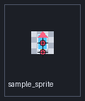

# Godot Asset Pipeline Doctor

CI-friendly PNG, audio, and Godot `.import` checks for pixel-art and mobile asset pipelines.

Use this before merging sprites, UI art, icons, backgrounds, sound effects, or other asset-heavy changes. It checks for import settings and asset shapes that commonly cause blurry pixel art, color fringes, large packages, or mobile memory surprises.

The tool is designed for generic Godot projects, including private commercial games. Public examples use placeholder project names and do not require publishing project-specific content. It does not need the Godot editor and does not run project scripts.

## What It Catches

- Missing Godot `.import` metadata next to PNG assets.
- Mipmaps enabled on pixel-art profile assets.
- Alpha-border fixing disabled on transparent assets.
- Fully transparent edge pixels that still contain RGB color data.
- Large textures that are risky for Android/mobile memory budgets.
- Very large texture dimensions that may exceed conservative device limits.
- Unexpectedly large palettes in pixel-art folders.
- Sprite manifest dimension mismatches and out-of-bounds anchors.
- Large or long audio clips that need compression or streaming review.
- Missing Godot `.import` metadata next to audio files.

## Install

From a local checkout:

```powershell
python -m pip install -e .
```

From PyPI:

```powershell
python -m pip install godot-asset-pipeline-doctor
```

## Quick Start

Scan a Godot project with the default profile:

```powershell
godot-asset-doctor C:\Projects\ArcadePrototype
```

Strict pixel-art check:

```powershell
godot-asset-doctor C:\Projects\ArcadePrototype --profile pixel-2d --fail-on warning
```

Android/mobile check with JSON output:

```powershell
godot-asset-doctor C:\Projects\ArcadePrototype --profile android-mobile --format json --output asset-report.json
```

Audio-focused mobile check:

```powershell
godot-asset-doctor C:\Projects\ArcadePrototype --profile audio-mobile --large-audio-mb 6 --max-audio-duration-seconds 90
```

Exclude generated or vendor folders:

```powershell
godot-asset-doctor C:\Projects\ArcadePrototype --exclude "addons/vendor/**" --exclude "assets/generated/**"
```

Validate a sprite manifest:

```powershell
godot-asset-doctor manifest check sprite-manifest.json --project C:\Projects\ArcadePrototype --format json --output reports\sprite-manifest.json
```

Create a sprite contact sheet with anchor markers:

```powershell
godot-asset-doctor manifest contact-sheet sprite-manifest.json --project C:\Projects\ArcadePrototype --output reports\sprite-contact-sheet.png
```

Example contact sheet:



Run through Python after installing the package:

```powershell
python -m godot_asset_doctor examples\tiny-godot-project --fail-on none
```

## Real Workflow: Review New Art Before A Merge

Run a strict pixel-art scan when a pull request changes `assets/`, `sprites/`, or `ui/`:

```powershell
godot-asset-doctor . --profile pixel-2d --fail-on warning --format json --output reports\asset-doctor.json
```

Use the findings to catch:

- pixel art imported with mipmaps enabled;
- transparent sprite edges that can show colored fringes;
- missing `.import` files that mean assets have not been opened by Godot yet;
- unexpectedly large textures before they land in the main branch.
- sprite anchors that fall outside the source PNG bounds.
- sprite contact sheets that make anchor placement easier to review.

For Android-focused review, switch profile:

```powershell
godot-asset-doctor . --profile android-mobile --fail-on error --format sarif --output reports\asset-doctor.sarif
```

## Profiles

| Profile | Use Case |
|---|---|
| `default` | Balanced local scan; combines pixel and mobile warnings. |
| `pixel-2d` | Sprites, UI, icons, tiles, and crisp 2D assets. |
| `android-mobile` | Mobile release review, especially large textures and missing import data. |
| `audio-mobile` | Mobile/package-size review for WAV, OGG, and MP3 assets. |

## Exit Codes

| Flag | Behavior |
|---|---|
| `--fail-on none` | Always exits `0` unless the CLI itself errors. |
| `--fail-on error` | Exits `1` if any error is found. This is the default. |
| `--fail-on warning` | Exits `1` if any warning or error is found. Useful for strict CI. |

## Config File

Create `.godot-asset-doctor.toml` in the project root:

```toml
profile = "pixel-2d"
format = "json"
fail_on = "warning"
output = "asset-report.json"
exclude = ["addons/vendor/**", "assets/generated/**"]
max_texture_dimension = 4096
large_texture_mb = 16
max_palette_colors = 256
large_audio_mb = 8
max_audio_duration_seconds = 120
```

Then run:

```powershell
godot-asset-doctor C:\Projects\ArcadePrototype
```

CLI flags override config values. Use these thresholds when your project needs stricter mobile budgets or a looser palette limit for UI art. See [docs/CONFIGURATION.md](docs/CONFIGURATION.md).

## Example Output

```text
Godot Asset Pipeline Doctor
Report schema: 1.1 | Tool: 0.1.8
Root: C:\Projects\ArcadePrototype
Profile: pixel-2d
Assets: 18 | Issues: 3 | Errors: 0 | Warnings: 3

[WARNING] Transparent edge RGB data: C:\Projects\ArcadePrototype\assets\player.png
  4 fully transparent edge pixel(s) carry non-black RGB values.
  Why it matters: Fully transparent edge pixels carry RGB data that can bleed into visible edges after filtering.
  Suggestion: Clean transparent RGB data or enable alpha-border fixing to reduce fringe artifacts.
```

JSON reports include report metadata plus a `rules` object with plain-language
rule titles and explanations. Text and SARIF output use the same rule names so
local and CI reports are easier to compare.

## Documentation

- [Rule reference](docs/RULE_REFERENCE.md)
- [Configuration](docs/CONFIGURATION.md)
- [Pixel-art workflow](docs/PIXEL_ART.md)
- [Mobile texture guide](docs/MOBILE_TEXTURES.md)
- [Audio asset guide](docs/AUDIO_ASSETS.md)
- [Sprite manifests](docs/SPRITE_MANIFESTS.md)
- [CI usage](docs/CI.md)
- [Troubleshooting](docs/TROUBLESHOOTING.md)

## Tests

```powershell
python -m unittest discover -s tests -v
```

## CI

The included GitHub Actions workflow installs the package and runs the test suite on Python 3.11, 3.12, and 3.13.

In a project CI job, install from PyPI and keep the report as an artifact:

```yaml
- run: python -m pip install godot-asset-pipeline-doctor
- run: godot-asset-doctor . --profile android-mobile --format json --output reports/asset-doctor.json
```

## Design Notes

- The scanner does not need a Godot binary.
- The scanner does not execute project scripts.
- The scanner does not upload files or contact external services.
- Default scans ignore common non-asset artifact folders such as `docs`, `logs`, and `test-results`.
- JSON reports can include local paths, so review them before sharing publicly.

## License

MIT. See [LICENSE](LICENSE).
