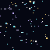
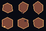

# Pixel Space Asset Toolkit

Deterministic procedural tools for pixel-art sci-fi prototypes: starfields, hex asteroid tiles, transparent-background cleanup, preview sheets, and Godot import guidance.

This repo is intentionally more visual than the audit tools, but it still behaves like a production CLI: fixed seeds, manifests, tests, and repeatable outputs.

## Install

```powershell
python -m pip install -e .
```

When published:

```powershell
python -m pip install pixel-space-asset-toolkit
```

## Quick Start

```powershell
pixel-space-assets starfield --width 1080 --height 1920 --seed 42 --stars 900 --output generated\starfield.png --manifest generated\starfield.json
pixel-space-assets asteroid-hex --material ferric --count 32 --size 64 --seed 7 --output generated\ferric
pixel-space-assets strip-background input.png --output cleaned.png --tolerance 4
pixel-space-assets preview generated\ferric --columns 8 --cell-size 64 --output generated\ferric_preview.png
pixel-space-assets starfield --width 1080 --height 1920 --seed 42 --stars 900 --output generated\starfield.png --format json
```

## Tools

- `starfield`: deterministic pixel starfield backgrounds.
- `asteroid-hex`: deterministic transparent hex asteroid tiles.
- `strip-background`: converts a flat corner-color background to alpha.
- `preview`: builds contact sheets for review.

## Sample Gallery

Generated from fixed seeds:





Open `examples/gallery/index.html` for a simple static gallery view.

## Documentation

- [Starfields](docs/STARFIELDS.md)
- [Asteroids](docs/ASTEROIDS.md)
- [Background stripping](docs/BACKGROUND_STRIPPING.md)
- [Preview sheets](docs/PREVIEWS.md)
- [Godot import guide](docs/GODOT_IMPORT.md)
- [CI usage](docs/CI.md)

## Development

```powershell
python -m pip install -e .
python -m unittest discover -s tests -v
pixel-space-assets starfield --width 64 --height 64 --seed 1 --stars 20 --output generated\starfield.png
```

Examples are generic and reproducible. Private project-specific art should stay outside the published repository unless intentionally released.
